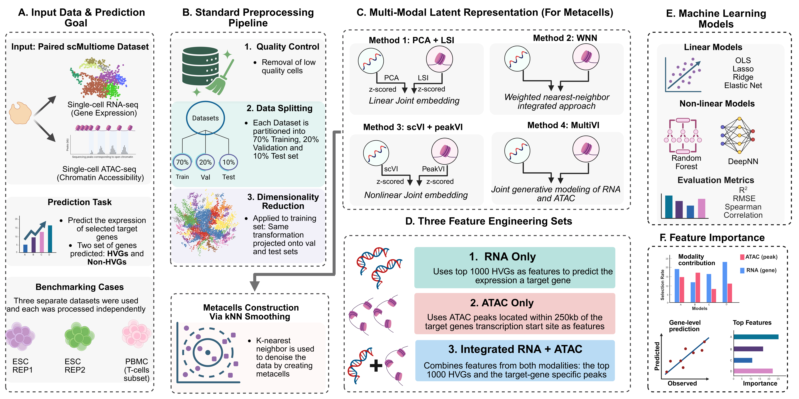

# scMultiPreDICT:  A single-cell predictive framework with transcriptomic and epigenetic signatures

## Overview

**scMultiPreDICT** (single-cell Multimodal Predictor of Gene Expression via Integrated Chromatin and Transcriptome) is a computational framework for predicting gene expression levels from single-cell multiome (joint RNA-seq and ATAC-seq) data. 

**Framework Overview**



### Key Predictors

- **Three Feature Sets**
  - **RNA-only**: RNA expression features only (top HVGs)
  - **ATAC-only**: Chromatin accessibility features only (peaks within ±250kb gene from transcription start site specific to each targer gene)
  - **Combined**: ATAC peaks (±250kb from transcription start site) + highly variable gene (HVG) RNA expression features


- **Dimensionality Reduction and Integrated Analysis Approaches for Metcall Construction**
  - **Combined pipeline**: PCA+LSI, Weighted Nearest Neighbor (WNN), scVI+PeakVI, MultiVI
  - **RNA-only pipeline**: PCA
  - **ATAC-only pipeline**: LSI

- **Comprehensive Model Comparison**
  - Ordinary Least Squares (OLS)
  - Ridge Regression (L2 regularization)
  - Lasso Regression (L1 regularization)
  - Elastic Net (combined L1/L2 regularization)
  - Random Forest
  - Deep Neural Networks (DeepNN)

## Installation

### 1. Clone the Repository

```bash
git clone https://github.com/UzunLab/scMultiPreDICT.git
cd scMultiPreDICT
```

### 2. Install R Dependencies

```bash
# Install with mouse annotation packages
Rscript combined/install_packages.R --species=mouse

# Install with human annotation packages
Rscript combined/install_packages.R --species=human

# Install core packages only (add species packages later)
Rscript combined/install_packages.R
```

Or run interactively in R:

```r
# CRAN packages
install.packages(c(
  # Core
  "Seurat", "Matrix", "dplyr", "tidyr", "ggplot2",
  # Machine learning
  "glmnet", "ranger", "caret",
  # Utilities
  "RANN", "reticulate", "patchwork", "viridis"
))

# Bioconductor packages
BiocManager::install(c(
  "Signac", "GenomicRanges", "GenomeInfoDb", 
  "rtracklayer", "IRanges", "S4Vectors"
))

# Species-specific (install one based on your data)
BiocManager::install("EnsDb.Mmusculus.v79")     # Mouse
BiocManager::install("EnsDb.Hsapiens.v86")      # Human
```

### 3. Install Python Dependencies (for neural networks and autoencoder methods)

```bash
pip install -r requirements.txt
```

> **Note:** Neural network training uses TensorFlow/Keras via Python (through the `reticulate` R package), not the R keras package.

### 4. Verify Installation

```bash
Rscript test_installation.R
```
This will check all required packages and configuration files.

### 5. Set Key Parameters in config.R

```r
# Sample name
SAMPLE_NAME <- "my_sample"

# Input paths
INPUT_MTX <- "/path/to/matrix.mtx.gz"
INPUT_FEATURES <- "/path/to/features.tsv.gz"
INPUT_BARCODES <- "/path/to/barcodes.tsv.gz"
INPUT_FRAGMENTS <- "/path/to/fragments.tsv.gz"

# Output directory
BASE_OUTPUT_DIR <- "/path/to/output"

# Species: "mouse" or "human"
SPECIES <- "mouse"
```

### 6. Generate SLURM Job Files

```bash
# From the combined/R directory (or rna_only/R, atac_only/R)
cd combined/R
Rscript -e 'source("config.R"); generate_all_sbatch()'
```

Or in an interactive R session:

### 7. Run the Pipeline

```bash
# Submit jobs in order # The my_sample will change based on your sample name. The information in each sbatch file will change based on cluster information provided in your edited config file.
sbatch step_01_my_sample.sbatch      # QC and Preprocessing
sbatch step_02b_my_sample.sbatch     # Select Target Genes
sbatch step_020_my_sample.sbatch     # Data Splitting
sbatch step_03b_my_sample.sbatch     # Export to MuData for Python
sbatch step_025_my_sample.sbatch     # Optional: GPU autoencoder training
sbatch step_030_my_sample.sbatch     # Metacell Creation
sbatch step_040_my_sample.sbatch     # Feature Extraction
sbatch step_050_my_sample.sbatch     # Linear/Tree Models
sbatch step_060_my_sample.sbatch     # Neural Network
```

## Quick Start Guide

### Selecting the Appropriate Pipeline

| Pipeline | Features Used | Recommended Use Case |
|----------|--------------|----------------------|
| `combined/` | RNA + ATAC | Full multiome analysis|
| `rna_only/` | RNA only | Evaluating gene expression-only prediction capability |
| `atac_only/` | ATAC only | Evaluating chromatin accessibility-only prediction capability |

### Running the Combined Pipeline

```bash
cd combined
cp config.R config.R
# Edit config.R with YOUR dataset-specific paths and parameters
# Key settings to modify:
#   - SAMPLE_NAME: Your sample identifier
#   - INPUT_MTX, INPUT_FEATURES, INPUT_BARCODES: Paths to your 10X files
#   - INPUT_FRAGMENTS: Path to your ATAC fragments file
#   - SPECIES: "mouse" or "human"
#   - BASE_OUTPUT_DIR: Where to save outputs
Rscript run_pipeline.R
```

### Running Single-Modality Pipelines

Single-modality pipelines (RNA-only, ATAC-only) require preprocessing outputs from the combined pipeline:

```bash
# Step 1: Run quality control and data splitting from combined pipeline
cd combined
Rscript R/01_quality_control.R
Rscript R/02_data_splitting.R

# Step 2: Run the single-modality pipeline
cd ../rna_only
cp config_template.R config.R
# Edit config.R to point to combined pipeline outputs
Rscript run_pipeline.R
```

## Repository Structure

```
scMultiPreDICT/ 
├── combined/                      # Full RNA+ATAC pipeline (Steps 1-6)
│   ├── config_template.R         # Configuration template (copy to config.R)
│   ├── config.R                  # Your dataset configuration (git-ignored)
│   ├── run_pipeline.R             # Pipeline orchestration script
│   ├── install_packages.R         # R dependency installer
│   ├── R/
│   │   ├── 01_quality_control.R
│   │   ├── 02_data_splitting.R
│   │   ├── 02b_select_target_genes.R
│   │   ├── 03_metacell_creation_pca_lsi.R # PCA+LSI method (default)
│   │   ├── 03_metacell_creation_wnn.R     # WNN method
│   │   ├── 03_metacell_creation_scvi_peakvi.R
│   │   ├── 03_metacell_creation_multivi.R
│   │   ├── 03b_export_to_mudata.R
│   │   ├── 04_feature_extraction.R
│   │   ├── 05_linear_tree_models.R
│   │   ├── 06_neural_network.R
│   │   
│   └── python/
│       └── train_autoencoders.py
│
├── rna_only/                      # RNA-only pipeline (Steps 3-8)
│   ├── config.R
│   ├── run_pipeline.R
│   └── R/
│
├── atac_only/                     # ATAC-only pipeline (Steps 3-8)
│   ├── config.R
│   ├── run_pipeline.R
│   └── R/
│
├── data/target_genes/             # Pre-computed target gene lists
│   ├── E7.5_rep1/
│   ├── E7.5_rep2/
│   └── T_Cells/
│
├── paper_figures/                 # Cross-dataset figure generation scripts
│
├── preprocessing/                 # Dataset-specific preprocessing
│   ├── 00_pbmc_preprocessing_and_tcell_subset.R  # T_Cells extraction
│   └── README.md
│
├── docs/                          # Additional documentation
│   ├── DIRECTORY_STRUCTURE.md
│   
├── requirements.txt               # Python dependencies
|
├── CITATION.cff                   # Citation metadata
├── LICENSE                        # MIT License
└── README.md
```

## Pipeline Description

### Combined Pipeline (Steps 1-9)

| Step | Script | Description |
|------|--------|-------------|
| 1 | `01_quality_control.R` | Cell filtering based on RNA and ATAC quality metrics |
| 2 | `02_data_splitting.R` | Stratified splitting into training, validation, and test sets (70/15/15) |
| 2b | `02b_select_target_genes.R` | Target gene selection (optional if using pre-computed gene lists) |
| 3 | `03_metacell_creation.R` | Metacell construction via k-nearest neighbor smoothing |
| 3b | `03b_export_to_mudata.R` | Export to MuData format for Python-based autoencoder training |
| 4 | `04_feature_extraction.R` | Extraction of gene-specific RNA and ATAC features |
| 5 | `05_linear_tree_models.R` | Training of linear models and Random Forest |
| 6 | `06_neural_network.R` | Training of deep neural networks |

### Single-Modality Pipelines

RNA-only and ATAC-only pipelines begin at Step 3, utilizing the QC-filtered Seurat object and data splits generated by the combined pipeline.

## Dimensionality Reduction Methods

| Pipeline | Method | Description |
|----------|--------|-------------|
| `combined/` | `pca_lsi` | PCA for RNA + LSI for ATAC, concatenated embeddings |
| | `wnn` | Weighted Nearest Neighbor integration (Seurat v4+) |
| | `scvi_peakvi` | Separate scVI and PeakVI autoencoders |
| | `multivi` | Joint MultiVI autoencoder |
| `rna_only/` | `pca` | Principal Component Analysis |
| `atac_only/` | `lsi` | Latent Semantic Indexing |


Configure the method in your `config.R`:

```r
DIM_REDUCTION_METHOD <- "pca_lsi"  # Options: "pca_lsi", "wnn", "scvi_peakvi", "multivi"
```

## High-Performance Computing (HPC) Usage

For datasets with large numbers of target genes, SLURM job submission is recommended:

```bash
cd combined/slurm/templates

# Edit templates with appropriate resource allocations
sbatch train_models.sbatch      # Linear and tree-based models
sbatch train_nn.sbatch          # Neural network models
```
 OR automatically generate sbatch files
```r
Rscript -e 'source("config.R"); generate_all_sbatch()' 
```

## Target Gene Configuration

### Overview

Target genes define **which genes'expression levels to predict** (the response variable Y). Two types are supported:

- **HVG (Highly Variable Genes)**: Top genes with high cell-to-cell expression variability
- **Random genes (Non-HVG)**: Control set of non-HVG genes meeting minimum expression thresholds

### Option 1: Use Pre-computed Target Genes (REQUIRED for Reproducibility)

> ⚠️ **IMPORTANT**: To reproduce published results, you **MUST** use the pre-computed target gene files. Auto-selection may yield different genes even with the same seed due to minor preprocessing variations.


```r
# In config.R - use pre-computed files (DEFAULT)
HVG_GENE_FILE <- "data/target_genes/E7.5_rep2/target_genes_hvg_100.txt"
RANDOM_GENE_FILE <- "data/target_genes/E7.5_rep2/target_genes_random_100.txt"
```

Available pre-computed files:
| Dataset | Path |
|---------|------|
| E7.5_rep1 | `data/target_genes/E7.5_rep1/target_genes_*.txt` |
| E7.5_rep2 | `data/target_genes/E7.5_rep2/target_genes_*.txt` |
| T_Cells | `data/target_genes/T_Cells/target_genes_*.txt` |

### Option 2: Auto-selection (NEW Datasets Only)

For analyzing **new datasets not included in the publication**, run Step 2b:

```r
# In config.R - for NEW datasets only
HVG_GENE_FILE <- ""
RANDOM_GENE_FILE <- ""

# Selection parameters
N_HVG_GENES <- 100
N_RANDOM_TARGET_GENES <- 100
```

> **Note**: The same target genes must be used across all three pipelines (combined, rna_only, atac_only) to enable fair performance comparison.

## Reproducing Published Results

### Generating Cross-Dataset Figures

After completing analysis on all datasets:

```bash
cd paper_figures
Rscript Multi_Dataset_Combined_Performance_Plots_HVG_SET.R
```
```bash
cd paper_figures
Rscript Multi_Dataset_Combined_Performance_Plots_HVG_SET.R
```

## Data Availability

| Dataset | Description | Species | GEO Accession |
|---------|-------------|---------|---------------|
| E7.5_rep1 | Mouse embryo E7.5 (replicate 1) | *Mus musculus* | `GSE205117` |
| E7.5_rep2 | Mouse embryo E7.5 (replicate 2) | *Mus musculus* | `GSE205117` |
| T_Cells | PBMC T cells (subset from 10x PBMC 10k) | *Homo sapiens* | [10x Genomics](https://www.10xgenomics.com/datasets/10-k-human-pbm-cs-multiome-v-1-0-chromium-x-1-standard-2-0-0) |

> **Note**: The T_Cells dataset was derived from the 10x Genomics PBMC 10k multiome dataset. T cells were identified using SingleR cell type annotation and extracted as a subset. See `preprocessing/` for the extraction script. The output goes directly to Step 02 (Data Splitting), skipping Step 01 (QC).

## Citation

If you use scMultiPreDICT in your research, please cite:

```bibtex
[Citation to be added upon publication]
```

## License

This project is licensed under the MIT License. See [LICENSE](LICENSE) for details.

## Contact

For questions, bug reports, or feature requests, please open an issue on the [GitHub repository](https://github.com/UzunLab/scMultiPreDICT/issues).
